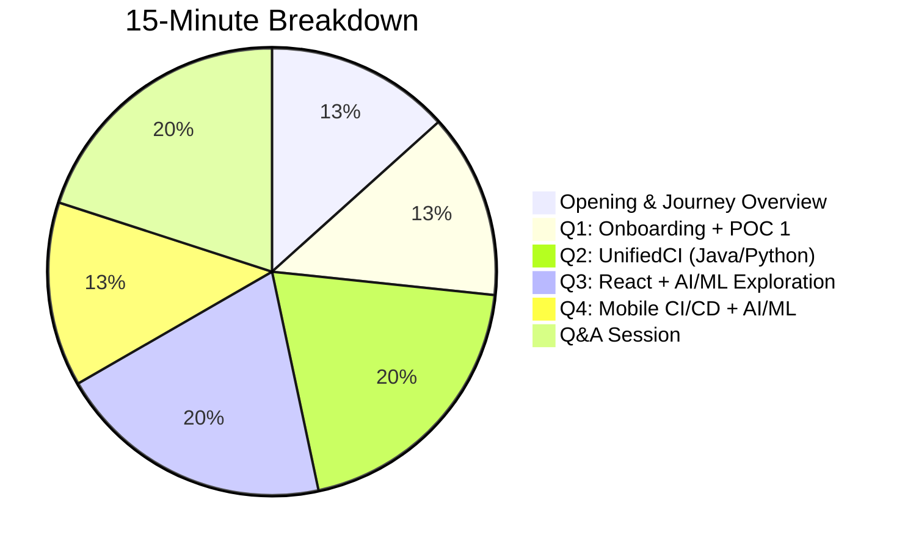

# 🎯 Internship Review Presentation Strategy
## Director-Level 15-Minute Presentation Guide

---

## 📊 Executive Summary

| **Aspect** | **Details** |
|------------|-------------|
| **Duration** | 15 minutes (10-11 min presentation + 4-5 min Q&A) |
| **Audience** | Associate Director & Director |
| **Tone** | High-level, business-impact focused, light technical terms |
| **Goal** | Showcase value delivered, growth achieved, and future potential |

---

## 📅 Corrected Timeline Overview

| Quarter | Theme | Key Deliverables |
|---------|-------|-----------------|
| **Q1 FY'25** | 📚 Onboarding & Learning | Jenkins, Docker, Scripting + **POC 1: Repository Maintenance** |
| **Q2 FY'25** | 🔧 UnifiedCI Foundation | Shared Library for **Java & Python** (Maven, Gradle, pip) |
| **Q3 FY'25** | 🚀 Extension & AI/ML | **React support** + AI/ML Exploration (Jenkins MCP) |
| **Q4 FY'26** | 📱 Mobile & Innovation | **Android CI/CD** + Advanced AI/ML Integration |

---

## ⏱️ Time Allocation Strategy



| Slide/Section | Time | Focus |
|---------------|------|-------|
| **1. Title + Introduction** | 30 sec | Hook their attention |
| **2. Journey Overview** | 1.5 min | 4-quarter high-level roadmap |
| **3. Q1: POC 1 - Repository Maintenance** | 2 min | Problem → Solution → Impact |
| **4-5. Q2: UnifiedCI (Java/Python)** | 3 min | Core deliverable, architecture |
| **6. Q3: React + AI/ML Exploration** | 3 min | Extension + MCP research |
| **7. Q4: Mobile CI/CD + AI/ML** | 2 min | Android pipeline + future |
| **8. Key Takeaways** | 30 sec | Summary of value delivered |
| **Q&A** | 3-5 min | Be prepared for deep-dives |

---

## 🎨 Recommended PPT Structure (8-10 Slides)

### Slide 1: Title Slide (30 seconds)
**Visual:** Clean, professional with your name and internship period

**Content:**
```
Internship Journey: Building Enterprise CI/CD Solutions
Manprit Singh Panesar
Q1 FY'25 - Q4 FY'26

Mentor: Viresh Hiremath | Solutioning: SunilKumar EK
```

**Speaking Script:**
> "Good [morning/afternoon], I'm Manprit Singh Panesar. Over the past year, I've been working on building scalable CI/CD automation solutions. Today, I'll walk you through my journey from learning to delivering production-ready solutions that impact multiple development teams across different technology stacks."

---

### Slide 2: Journey Overview - 4 Quarters at a Glance (1.5 minutes)
**Visual:** Timeline infographic with 4 colored boxes (matching your timeline image)

**Content (Minimal text - use icons):**

| Q1 FY'25 | Q2 FY'25 | Q3 FY'25 | Q4 FY'26 |
|----------|----------|----------|----------|
| 📚 Onboarding | 🔧 UnifiedCI Core | 🚀 React + AI/ML | 📱 Mobile CI/CD |
| Repository Maintenance POC | Java & Python | React Extension + MCP | Android + AI/ML |

**Speaking Script:**
> "My internship was structured into four strategic phases. In Q1, I focused on onboarding and delivered my first POC for repository maintenance automation. Q2 was about building the core UnifiedCI Shared Library supporting Java and Python. In Q3, I extended this to React and began exploring AI/ML integration with Jenkins MCP. Currently in Q4, I'm implementing Mobile CI/CD for Android and advancing our AI/ML capabilities."

---

### Slide 3: Q1 - POC 1: Automated Repository Maintenance (2 minutes)
**Visual:** Before/After comparison + Simple 4-step workflow diagram

**Content:**
**The Problem:**
- ❌ Stale PRs accumulating in repositories
- ❌ Manual branch cleanup consuming developer time
- ❌ No standardized cleanup process

**The Solution:** Automated Jenkins Pipeline
```
Step 1: Tag PRs → Step 2: Label Old PRs → Step 3: Close Stale → Step 4: Clean Branches
```

**Impact:**
- ⏱️ Automated what was manual
- 📈 Cleaner repository hygiene
- 🔄 Standardized process

**Speaking Script:**
> "My first POC addressed a common pain point - repository maintenance. Teams were spending valuable time manually cleaning up stale pull requests and branches. I built an automated Jenkins pipeline with four key stages: it identifies old PRs, labels them for tracking, closes stale ones, and cleans up associated branches automatically. The main challenge was handling edge cases - some old PRs are still needed. I solved this by implementing a tagging system that teams can use to mark PRs as 'keep-open'."

---

### Slide 4: Q2 - UnifiedCI Shared Library: The Problem (30 seconds)
**Visual:** 4 teams with different Jenkinsfiles showing chaos

**Content:**
**Before UnifiedCI:**
| Team A (Python) | Team B (Java) | Team C (Python) | Team D (Java) |
|-----------------|---------------|-----------------|---------------|
| 300 lines | 350 lines | 250 lines | 150 lines |
| Different stages | Different tools | No linting | Manual Docker |

**Problems Solved:**
- 🔴 Code Duplication - same logic repeated
- 🔴 Maintenance Nightmare - fix bugs everywhere
- 🔴 Inconsistency - different quality gates
- 🔴 Quality Gaps - some skip important checks

**Speaking Script:**
> "This brings me to the main project - UnifiedCI. Before this solution, every team maintained their own Jenkinsfile - 200 to 350 lines of custom code. Python teams, Java teams - all with different approaches. Bug fixes had to be applied individually. Quality gates were inconsistent. This wasn't scalable for an organization."

---

### Slide 5: Q2 - UnifiedCI Solution & Architecture (2.5 minutes)
**Visual:** Architecture diagram: One Library → Templates → Multiple Teams

**Content:**
**What is UnifiedCI?**
A centralized Jenkins Shared Library providing:
- 📦 One Library → Multiple Tech Stacks
- 🔧 Pre-built templates with best practices
- ⚡ Auto-detection of project type
- 📊 Standardized reporting + Notifications

**Q2 Deliverables (Java & Python):**
| Feature | Java Support | Python Support |
|---------|-------------|----------------|
| **Build** | Maven, Gradle | pip, setuptools |
| **Lint** | Checkstyle, SpotBugs | Pylint, flake8, Black |
| **Test** | JUnit, Surefire | pytest, unittest |
| **Docker** | Maven/Gradle images | Python 3.8-3.11 |

**Business Value:**
- 📉 Jenkinsfile: 300 lines → 10-15 lines
- ⏱️ Setup: Days → Hours
- 🔧 One fix benefits all projects

**Speaking Script:**
> "UnifiedCI is a centralized shared library that provides pre-built CI templates. Think of it as 'CI-as-a-Service'. In Q2, I built the foundation supporting Java and Python. For Java, we support both Maven and Gradle builds with Checkstyle and SpotBugs for linting, JUnit for testing. For Python, we support pip builds with Pylint and flake8 for linting, pytest for testing. The library auto-detects project type from configuration files. What used to require 300 lines of custom configuration is now just 10-15 lines. One update to the library benefits all consuming projects."

---

### Slide 6: Q3 - React Extension + AI/ML Exploration (3 minutes)
**Visual:** Two sections - React support diagram + AI/ML exploration with brain icon

**Content:**
**Part 1: React/React Native Support**
- Extended CI framework for React ecosystem
- npm-based build pipeline
- Jest/Cypress/Mocha testing integration
- ESLint + Prettier for code quality
- Node 18, 20, latest Docker images

**Part 2: AI/ML Exploration**
- 🧠 Studied AI/ML fundamentals for CI/CD use cases
- 🔌 Explored **Jenkins MCP (Model Context Protocol)** for AI-assisted CI
- 🎯 Identified areas for AI/ML optimization:
  - Intelligent failure analysis
  - Predictive build optimization
  - Automated issue resolution

**Q3 Outcomes:**
- ✅ Extended CI framework with React/language support
- ✅ Stabilized reusable CI stages across projects
- ✅ Comprehensive docs, PPTs, onboarding guidelines
- ✅ Future roadmap defined

**Speaking Script:**
> "Q3 had two major focus areas. First, I extended UnifiedCI to support React and React Native projects. This meant integrating npm builds, Jest and Cypress testing, ESLint for linting - the complete React ecosystem. Second, I began exploring AI/ML integration for CI/CD. I studied how machine learning can optimize our pipelines and explored Jenkins MCP - Model Context Protocol - which enables AI-assisted CI interaction. The idea is to have AI analyze build failures and suggest fixes, or predict build times based on code changes. I documented everything - including comprehensive onboarding guidelines and a future roadmap."

---

### Slide 7: Q4 - Mobile CI/CD + AI/ML Solution (2 minutes)
**Visual:** Android pipeline flow + AI/ML integration diagram

**Content:**
**Mobile CI/CD (Android) - Ongoing:**
- 🐳 Docker-based Android build environment
- 📱 Reusable pipeline stages:
  - Environment setup
  - Android build (APK/AAB)
  - Unit and E2E testing
  - Fastlane deployment
- 🚀 **Integration & Testing:**
  - Google Play Store deployment
  - Slack/Email notifications
  - Validated with sample React Native apps

**AI/ML (Initial Scope):**
- 🎯 High-level approach for AI/ML in CI framework
- 🔍 Identifying CI areas for AI/ML improvements:
  - Log analysis using LLMs
  - Build failure prediction
  - Smart test selection

**Q4 Outcomes (In Progress):**
- ✅ Android CI/CD enabled in shared library
- ✅ Working mobile CI/CD POC delivered
- 🔄 Preparing CI framework for future AI/ML integration

**Speaking Script:**
> "Q4 is about mobile and intelligence. For Mobile CI/CD, I created a Docker-based Android build environment for consistency. The pipeline handles environment setup, APK and AAB generation, unit and E2E testing through Fastlane, and automated Google Play Store deployment. I've validated this with sample React Native applications. On the AI/ML side, I'm defining the approach for integrating intelligence into our CI framework - identifying which areas benefit most from AI, like log analysis using LLMs for suggesting fixes, or predicting which builds are likely to fail. This is still early-stage but represents our future direction."

---

### Slide 8: Key Achievements & Thank You (30 seconds)
**Visual:** Summary with key metrics and icons

**Content:**
**What I Delivered Across 4 Quarters:**

| POC | Description | Status |
|-----|-------------|--------|
| POC 1 | Automated Repository Maintenance | ✅ Complete |
| POC 2 | UnifiedCI - Java & Python | ✅ Complete |
| POC 3 | UnifiedCI - React + AI/ML Exploration | ✅ Complete |
| POC 4 | Mobile CI/CD + AI/ML Solution | 🔄 In Progress |

**Business Impact:**
- 🎯 One library supporting 4 tech stacks (Java, Python, React, Android)
- ⏱️ Pipeline setup: Days → Hours
- 📉 Jenkinsfile complexity: 300+ lines → 10-15 lines
- 📚 Comprehensive documentation for adoption

**Speaking Script:**
> "To summarize, across four quarters I delivered four POCs - from repository automation to a multi-language shared library to mobile CI/CD. The UnifiedCI library now supports Java, Python, React, and Android. What took days to set up now takes hours. What required 300 lines of code now needs just 10-15. I've also created comprehensive documentation for organization-wide adoption. Thank you for this opportunity - I'm happy to take any questions."

---

## ❓ Q&A Preparation

### Business Impact Questions

**Q1: "What is the ROI of your work?"**
> "UnifiedCI reduces pipeline setup time from days to hours. For an organization with 50+ projects, if each saves 2 days of setup, that's 100+ developer-days returned to actual development. Consistent quality gates also mean fewer production issues."

**Q2: "How many teams are using this?"**
> "The library has been validated with demo projects across Java, Python, React, and Android stacks. We're preparing for organization-wide rollout with comprehensive documentation. The adoption approach is gradual - pilot teams first, then broader rollout."

---

### Technical Questions

**Q3: "How does auto-detection work?"**
> "The library scans for signature files - pom.xml for Maven, build.gradle for Gradle, requirements.txt for Python, package.json for React. Based on what it finds, it applies the appropriate template."

**Q4: "What about security in pipelines?"**
> "Security is built-in. We enforce code linting which catches common vulnerabilities. Docker ensures isolated builds. Secrets are managed through Jenkins credentials store, never hardcoded."

**Q5: "How does mobile CI/CD handle signing?"**
> "Signing certificates are managed through Jenkins credentials store. Fastlane references these securely. We support debug and release signing with separate Play Store deployment configurations."

**Q6: "What is Jenkins MCP and how does AI help?"**
> "Jenkins MCP - Model Context Protocol - is a framework for AI-assisted CI interaction. It allows LLMs to understand build context, analyze failure logs, and suggest fixes. We're exploring this for intelligent failure analysis and predictive optimization."

---

### Growth & Learning Questions

**Q7: "What was your biggest challenge?"**
> "Designing for extensibility while keeping things simple. Every team has slightly different needs, so I built a configuration-based system using YAML files. Balancing flexibility with standardization was the key challenge I solved."

**Q8: "What would you do differently?"**
> "I would start documentation earlier - writing docs retrospectively is harder. Also, I'd pilot with a real production team earlier for faster feedback."

**Q9: "What did you learn beyond technical skills?"**
> "I learned to think at organizational scale - solutions that work for many teams, not just one. I also improved my communication skills - explaining technical concepts to different audiences."

---

### Future Vision Questions

**Q10: "Where do you see this going?"**
> "Short term - complete Android CI/CD and drive organization adoption. Medium term - iOS support and cloud auto-scaling. Long term - full AI/ML integration for intelligent failure analysis and predictive builds."

**Q11: "How feasible is AI/ML integration?"**
> "Very feasible with current technologies. OpenAI's APIs can analyze logs effectively. Jenkins MCP provides the integration framework. The challenge is accuracy tuning. Q4 is our exploration phase to validate which AI use cases provide the most value."

**Q12: "What happens after your internship ends?"**
> "The library is fully documented with onboarding guides. Any team can maintain and extend it. I've also identified future improvements in the roadmap - the next person can continue from a solid foundation."

---

## 🎤 Speaking Tips for Directors

### DO's ✅
- Lead with business impact: "This saves X hours" > "This uses Y technology"
- Use analogies: "Think of it as CI-as-a-Service"
- Be concise: One idea per sentence
- Show confidence: You built this!

### DON'Ts ❌
- Don't read from slides
- Don't over-explain technical details
- Don't apologize for ongoing work - frame it as progress
- Don't rush through demos

### Power Phrases:
- "The key insight here is..."
- "What this means for the organization is..."
- "From a scalability perspective..."

---

## 📹 Demo Recommendations

| POC | Demo Content | Duration |
|-----|-------------|----------|
| POC 1 | Dashboard showing closed PRs + clean repo | 20 sec |
| POC 2 | Jenkinsfile (10 lines) → Pipeline running → Allure report | 45 sec |
| POC 3 | React project build + Slack notification | 30 sec |
| POC 4 | Android build → APK generated → Test results | 30 sec |

---

## ✅ Final Checklist

- [ ] PPT has max 8-10 slides
- [ ] Each slide has minimal text (5-7 bullets max)
- [ ] Demo videos are 20-45 seconds each
- [ ] Practice full presentation 3 times
- [ ] Time yourself (stay under 12 minutes)
- [ ] Prepare 2-3 questions to ask them
- [ ] Have backup screenshots if demos fail

---

> **Remember:** You're telling the story of your growth and the value you created. Be proud of your work! 🚀
